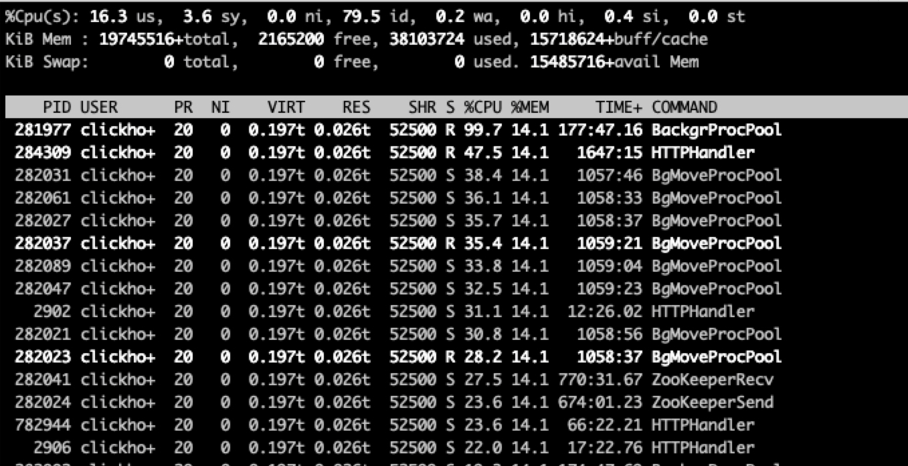
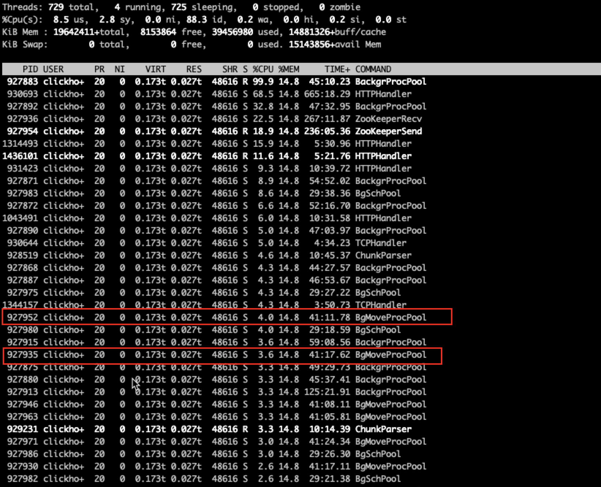
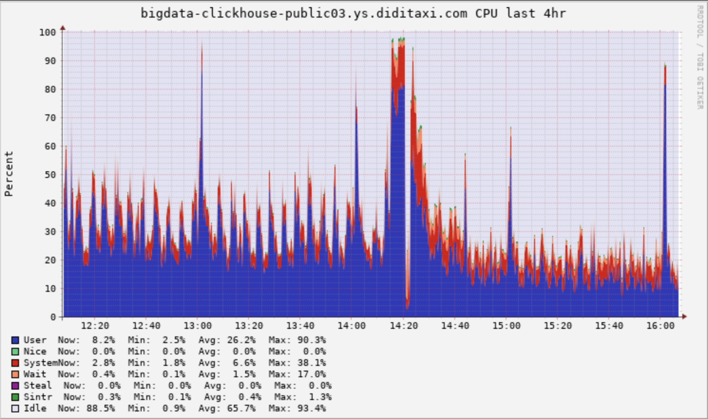

ClickHouse 是俄罗斯的 Yandex 于 2016 年开源的一个高性能的分布式列存数据库，是一个彪悍的 `OLAP` 引擎。下面将介绍文章的标题在Clickhouse上是如何实现的。

# 发现问题
调查CPU问题首先使用的是top命令，由于节点上只部署了一个Clickhouse服务，直接  `top -Hp pid`  查看使用 CPU 最高的线程，如下图：



根据上一个篇对[ReplicatedMergeTree 后台任务的工作原理][1]分析，可以清楚的看到，第一个线程`BackgrProcPool`是负责所有`ReplicatedMergeTree`表的merge和mutation任务，这个两个任务都是很耗CPU的，第二个`HTTPHandler`线程是处理http请求的，在往下看，会发现有8个`BgMoveProcPool`线程占大量的CPU，他们是负责磁盘间的数据均衡，当磁盘使用超过了设定的阀值，就会选择该块磁盘上的part文件移动到其他的磁盘。移动阀值默认是0.9，该线程池默认最大的线程数为8。

持续监听了一段时间，发现这8个线程的CPU占用几乎是一直排在前面的，到这有了这样的疑问，难道真的有磁盘已经达到了0.9阀值，所有的Move线程都在磁盘间搬迁数据？但是线上磁盘使用到了80%就会报警，难道报警有问题？

使用`df -h`确认磁盘的状况，查询后12块盘使用率都在50%左右，那奇怪了这8个Move线程占着CPU在究竟做什么？

# 确认问题
为了搞清楚Move线程具体在执行什么，使用`pstack pid`抓取此时的堆栈，发现8个线程的堆栈大体如下所示：

```
Thread 1185 (Thread 0x7ff6fceef700 (LWP 315352)):
#0  0x000000000ff90557 in std::__1::back_insert_iterator<std::__1::vector<std::__1::shared_ptr<DB::IMergeTreeDataPart const>, ...... DB::MergeTreeData::LessDataPart&) ()
#1  0x000000000ff699f5 in DB::MergeTreeData::getDataPartsVector(std::initializer_list<DB::IMergeTreeDataPart::State> const&, ......) const ()
#2  0x000000000ff69b40 in DB::MergeTreeData::getDataPartsVector() const ()
#3  0x0000000010010ea2 in DB::MergeTreePartsMover::selectPartsForMove(std::__1::vector<DB::MergeTreeMoveEntry, std::__1::allocator<DB::MergeTreeMoveEntry> >&, std::__1::function<bool (std::__1::shared_ptr<DB::IMergeTreeDataPart const> const&, std::__1::basic_string<char, std::__1::char_traits<char>, std::__1::allocator<char> >*)> const&, std::__1::lock_guard<std::__1::mutex> const&) ()
#4  0x000000000ff6ef5a in DB::MergeTreeData::selectPartsForMove() ()
#5  0x000000000ff86096 in DB::MergeTreeData::selectPartsAndMove() ()
#6  0x000000000fe5d102 in std::__1::__function::__func<DB::StorageReplicatedMergeTree::startBackgroundMovesIfNeeded()::{lambda()#1}, std::__1::allocator<{lambda()#1}>, DB::BackgroundProcessingPoolTaskResult ()>::operator()() ()
#7  0x000000000ff269df in DB::BackgroundProcessingPool::workLoopFunc() ()
#8  0x000000000ff272cf in _ZZN20ThreadFromGlobalPoolC4IZN2DB24BackgroundProcessingPoolC4EiRKNS2_12PoolSettingsEPKcS7_EUlvE_JEEEOT_DpOT0_ENKUlvE_clEv ()
#9  0x000000000930b8bd in ThreadPoolImpl<std::__1::thread>::worker(std::__1::__list_iterator<std::__1::thread, void*>) ()
#9  0x000000000930b8bd in ThreadPoolImpl<std::__1::thread>::worker(std::__1::__list_iterator<std::__1::thread, void*>) ()
#10 0x0000000009309f6f in void* std::__1::__thread_proxy ...... scheduleImpl<void>(std::__1::function<void ()>, int, std::__1::optional<unsigned long>)::{lambda()#3}>) ()
#11 0x00007ff91f4d5ea5 in start_thread () from /lib64/libpthread.so.0
#12 0x00007ff91edf2b0d in clone () from /lib64/libc.so.6 
```
从堆栈中看到所有的Move线程都是在执行`selectPartsForMove()`方法，多次抓取后都未发现`moveParts()`方法，但仍不确定此时是不是真的没有move part，接着通过系统表`part_log`查询最近一天move part的信息。
```
SELECT * FROM system.part_log WHERE event_time > now() - toIntervalDay(1) AND event_type = 'MovePart'
```
发现一条记录都没有，这一刻，可以确定这个8个move线程占着大量CPU，一直在`select part for move`，但却没有发挥任何实际的作用。

在回到上面的堆栈信息可以看到，`selectPartsForMove()`方法里面调用了`getDataPartsVector()`方法，获取表中所有的part，猜测move线程会去遍历所有的part，从中选择part移动，但公共集群的数据量比较大，part多，遍历所有的part需要消耗大量CPU。

接着查询系统表`parts`，发现节点上总共有30多万part，最多的一个表有6万多个part，总共有6千多张表。

现在大致可以确定CPU都耗在了遍历所有表的part上了，那么问题就来了，磁盘空间都很充足，为什么要去遍历part呢？

为了得到真相，就必须去看`selectPartsForMove()`方法如何实现的，核心源码如下：

```
bool MergeTreePartsMover::selectPartsForMove(MergeTreeMovingParts & parts_to_move, const AllowedMovingPredicate & can_move, const std::lock_guard<std::mutex> & /* moving_parts_lock */) {
  	/// 获取所有的part
    MergeTreeData::DataPartsVector data_parts = data->getDataPartsVector();
    if (data_parts.empty())
        return false;

    std::unordered_map<DiskPtr, LargestPartsWithRequiredSize> need_to_move;
    const auto policy = data->getStoragePolicy();
    const auto & volumes = policy->getVolumes();
    ///  获取超过阀值的disk
    if (!volumes.empty()) {
        /// Do not check last volume
        for (size_t i = 0; i != volumes.size() - 1; ++i) {
            /// 遍历所有的disk，将超过阀值的disk添加need_to_move
            for (const auto & disk : volumes[i]->getDisks()) {
                UInt64 required_maximum_available_space = disk->getTotalSpace() * policy->getMoveFactor(); /// move_factor默认0.9
                UInt64 unreserved_space = disk->getUnreservedSpace();
		    /// 未使用的空间小于总空间的10%，则该disk需要移动
                if (unreserved_space < required_maximum_available_space)
                    need_to_move.emplace(disk, required_maximum_available_space - unreserved_space);
            }
        }
    }
    /// 遍历所有的part
    time_t time_of_move = time(nullptr);
    for (const auto & part : data_parts) {
      	/// 检查part的move_ttl，用于冷热分层
        auto ttl_entry = data->selectTTLEntryForTTLInfos(part->ttl_infos, time_of_move);
        auto to_insert = need_to_move.find(part->volume->getDisk());
	.....
        /// 将符合条件的part添加到parts_to_move中
        parts_to_move.emplace_back(part, std::move(reservation));
        ......
        /// 为超过阀值的disk添加待移动的part
        if (to_insert != need_to_move.end())
        	to_insert->second.add(part);
    }
}
```
从上面的代码分析上可以看出，遍历part做了两件事，第一将达到`move_ttl`的part添加到`parts_to_move`中等待移动，第二为超过阀值的`disk`添加备选的part。

# 解决问题
到这里已经心中有数了，线上集群磁盘剩余空间很足，即`need_to_move`为空，并且也没有设置冷热分层，即`move_ttl`为空，两个条件都不满足是不是就可以不用去遍历所有的part，这样就能节省大量的CPU了。

于是在遍历part之前添加下面两行代码，当超过阀值的`disk`为空并且没有设置`move_ttl`，就直接返回false。

```
if (need_to_move.empty() && !metadata_snapshot->hasAnyMoveTTL())
    return false;
```

## 实际效果

上线到了国内公共集群，top观察各个线程消耗的CPU，可以发现在前面已经找不到`BgMoveProcPool`线程了，8个线程占用的CPU也从之前的**30%**左右都降到了**4%**以下。



我们在来观察一下机器整体的CPU，可以发现清晰的发现`User CPU`由升级前的**20%**左右降到了**10%**左右。




并将这个优化贡献给了社区，已经被merge到master。[https://github.com/ClickHouse/ClickHouse/pull/33225][2]

# 后续思考

很多时候代码在数据量小、并发小的时候不会有问题，一旦数据量、并发上来了就会发生意想不到的结果，在后续写代码的过程中多思考一下这些情况，敬畏每一行代码。


[1]: http://way.xiaojukeji.com/article/32148
[2]: https://github.com/ClickHouse/ClickHouse/pull/33225
