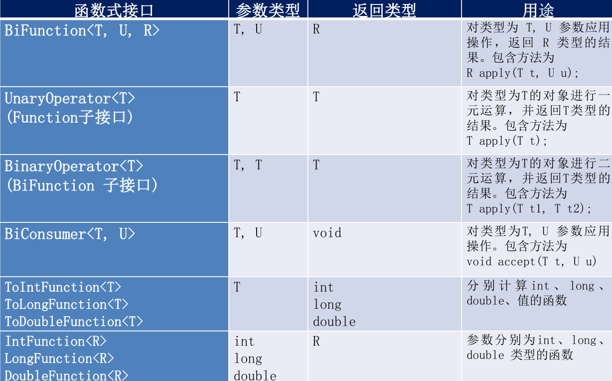

# Java8 新特性

## Lambda 表达式

### Lambda 表达式的基础语法：

Java8中引入了一个新的操作符 "**->**" 该操作符称为箭头操作符或 Lambda 操作符箭头操作符将 Lambda 表达式拆分成两部分：

- 左侧：Lambda 表达式的**参数列表**；
- 右侧：Lambda 表达式中所需**执行的功能**， 即 Lambda 体；

 ```java
public void test1(){
		int num = 0;//jdk 1.7 前，必须是 final
		Runnable r = new Runnable() {
			@Override
			public void run() {
				System.out.println("Hello World!" + num);
			}
		};
        
		System.out.println("-------------------------------");
		Runnable r1 = () -> System.out.println("Hello Lambda!");
        
        // 创建一个比较器
       Comparator<Integer> com = (x, y) -> Integer.compare(x, y);
	}
```

Lambda 表达式需要“函数式接口”的支持

函数式接口：接口中只有一个抽象方法的接口，称为函数式接口。 可以使用注解**@FunctionalInterface** 修饰可以检查是否是函数式接口；

```java
@FunctionalInterface
public interface MyPredicate<T> {
	public boolean test(T t);
}
```


### 内置的四大核心函数式接口
 
>Consumer<T> : 消费型接口
>	void accept(T t);
>
>Supplier<T> : 供给型接口
>	T get(); 
> 
>Function<T, R> : 函数型接口
> 	R apply(T t);
>
>Predicate<T> : 断言型接口
>	boolean test(T t);

```java
//Consumer<T> 消费型接口 :
	@Test
	public void test1(){
		happy(10000, (m) -> System.out.println("逛个商场，每次消费：" + m + "元"));
	} 
	
	public void happy(double money, Consumer<Double> con){
		con.accept(money);
	}
```

其他接口（了解）：



### 方法引用与构造器引用

方法引用：若 Lambda 体中的功能，**已经有方法提供了实现**，可以使用方法引用
			  （可以将方法引用理解为 Lambda 表达式的另外一种表现形式）

- 对象的引用 :: 实例方法名

```java
	//对象的引用 :: 实例方法名
	@Test
	public void test2(){
		Employee emp = new Employee(101, "张三", 18, 9999.99);
		
		Supplier<String> sup = () -> emp.getName();
		System.out.println(sup.get());
		
		System.out.println("----------------------------------");
		
		Supplier<String> sup2 = emp::getName;
		System.out.println(sup2.get());
	}
	
	@Test
	public void test1(){
		PrintStream ps = System.out;
		Consumer<String> con = (str) -> ps.println(str);
		con.accept("Hello World！");
		
		System.out.println("--------------------------------");
		
		Consumer<String> con2 = ps::println;
		con2.accept("Hello Java8！");
		
		Consumer<String> con3 = System.out::println;
	}
```

- 类名 :: 静态方法名

```java
	//类名 :: 静态方法名
	@Test
	public void test4(){
		Comparator<Integer> com = (x, y) -> Integer.compare(x, y);
		
		System.out.println("-------------------------------------");
		
		Comparator<Integer> com2 = Integer::compare;
	}
	
	@Test
	public void test3(){
		BiFunction<Double, Double, Double> fun = (x, y) -> Math.max(x, y);
		System.out.println(fun.apply(1.5, 22.2));
		
		System.out.println("--------------------------------------------------");
		
		BiFunction<Double, Double, Double> fun2 = Math::max;
		System.out.println(fun2.apply(1.2, 1.5));
	}
```

- 类名 :: 实例方法名

```java
	//类名 :: 实例方法名
	@Test
	public void test5(){
		BiPredicate<String, String> bp = (x, y) -> x.equals(y);
		System.out.println(bp.test("abcde", "abcde"));
		
		System.out.println("-----------------------------------------");
		
		BiPredicate<String, String> bp2 = String::equals;
		System.out.println(bp2.test("abc", "abc"));
		
		System.out.println("-----------------------------------------");
		
		
		Function<Employee, String> fun = (e) -> e.show();
		System.out.println(fun.apply(new Employee()));
		
		System.out.println("-----------------------------------------");
		
		Function<Employee, String> fun2 = Employee::show;
		System.out.println(fun2.apply(new Employee()));
		
	}
```

注意：
1. **方法引用所引用的方法的参数列表与返回值类型，需要与函数式接口中抽象方法的参数列表和返回值类型保持一致**！

2. 若Lambda 的参数列表的**第一个参数**，**是实例方法的调用者**，**第二个参数(或无参)是实例方法的参数时**，格式：ClassName::MethodName；

构造器引用 :构造器的参数列表，需要与函数式接口中参数列表保持一致！

- 类名 :: new
```java
	//构造器引用
	@Test
	public void test7(){
		Function<String, MyClass> fun = (str) -> new MyClass(str);
		
		Function<String, MyClass> fun = MyClass::new;
	}
	
```

数组引用

- 类型[] :: new;
```java
	//数组引用
	@Test
	public void test8(){
		Function<Integer, String[]> fun = (args) -> new String[args];

        Function<Integer, String[]> fun = String[]::new;
	}
```


## Stream API( java.util.stream .*)

Stream是数据渠道，用于操作数据源（集合、数组等）所生成的元素序列 

>注意：
>1. Stream 自己不会存储元素。
>2. Stream 不会改变源对象。相反，他们会返回一个持有结果的新Stream。
>3. Stream 操作是延迟执行的。这意味着他们会等到需要结果的时候才执行。

Stream API 的操作步骤：

1. 创建 Stream；
```java
	@Test
	public void test1(){
		//1. Collection 提供了两个方法  stream() 与 parallelStream()
		List<String> list = new ArrayList<>();
		Stream<String> stream = list.stream(); //获取一个顺序流
		Stream<String> parallelStream = list.parallelStream(); //获取一个并行流
		
		//2. 通过 Arrays 中的 stream() 获取一个数组流
		Integer[] nums = new Integer[10];
		Stream<Integer> stream1 = Arrays.stream(nums);
		
		//3. 通过 Stream 类中静态方法 of()
		Stream<Integer> stream2 = Stream.of(1,2,3,4,5,6);
		
		//4. 创建无限流
		//迭代
		Stream<Integer> stream3 = Stream.iterate(0, (x) -> x + 2).limit(10);
		stream3.forEach(System.out::println);
		
		//生成
		Stream<Double> stream4 = Stream.generate(Math::random).limit(2);
		stream4.forEach(System.out::println);
		
	}
```

2. 中间操作；

筛选与切片：
- filter(Predicate p)
- distinct()
- limit(long maxSize)
- skip(long n)	扔掉前n个元素，与limit(n)互补

映射：
- map(Function f)
- flatMap(Function f)

排序：
- sorted()
- sorted(Comparator comp)

```java
//内部迭代：迭代操作 Stream API 内部完成
@Test
public void test2(){
	//所有的中间操作不会做任何的处理
	Stream<Employee> stream = emps.stream()
		.filter((e) -> {
			System.out.println("测试中间操作");
			return e.getAge() <= 35;
		});
	
	//只有当做终止操作时，所有的中间操作会一次性的全部执行，称为“惰性求值”
	stream.forEach(System.out::println);
}
```

3. 终止操作(终端操作)；

查找与匹配：
- findFirst()
- count()
- max(Comparator c)
- min(Comparator c)
- forEach(Consumer c)

归约：
- reduece(T iden, BinaryOperator b) 将流中元素反复结合起来，得到一个值，返回T
- reduece(T iden, BinaryOperator b) 将流中元素反复结合起来，得到一个值，返回Optional<T>

收集：
- collect(Collector c)


```java
@Test
public void test6(){
	emps.stream()
		.forEach(System.out::println);
}
```

**Java 8 中将并行进行了优化，我们可以很容易的对数据进行并行操作。Stream API 可以声明性地通过 parallel() 与sequential() 在并行流与顺序流之间进行切换。**

```java
@Test
public void test3(){
	long start = System.currentTimeMillis();
	
	Long sum = LongStream.rangeClosed(0L, 10000000000L)
						 .parallel()// 转为并行流
						 .sum();
	
	System.out.println(sum);
	
	long end = System.currentTimeMillis();
	
	System.out.println("耗费的时间为: " + (end - start)); //2061-2053-2086-18926
}
```

## 接口中的默认方法与静态方法

Java 8中允许接口中包含具有具体实现的方法，该方法称为“默认方法”，默认方法使用 **default** 关键字修饰。

>接口默认方法的类优先原则
>1. 若一个接口中定义了一个默认方法，而另外一个父类或接口中又定义了一个同名的方法时，选择父类中的方法。
>2. 如果一个父类提供了具体的实现，那么接口中具有相同名称和参数的默认方法会被忽略。
>3. 接口冲突。如果一个父接口提供一个默认方法，而另一个接口也提供了一个具有相同名称和参数列表的方法（不管方法是否是默认方法），那么必须覆盖该方法来解决冲突。

```java
public interface MyInterface {
	
	default String getName(){
		return "接口中的默认方法";
	}
	
	public static void show(){
		System.out.println("接口中的静态方法");
	}
}

```
## 新时间日期 API

- LocalDate 、LocalTime 、LocalDateTime

>**LocalDate**、**LocalTime**、**LocalDateTime** 类的实例是**不可变的对象**，分别表示使用 ISO-8601日历系统的**日期**、**时间**、**日期和时间**。它们提供了简单的日期或时间，并不包含当前的时间信息。也不包含与时区相关的信息。

```java
@Test
	public void test1(){
    // 获取当前日期时间
		LocalDateTime ldt = LocalDateTime.now();
		System.out.println(ldt);
		// 指定日期和时间
		LocalDateTime ld2 = LocalDateTime.of(2016, 11, 21, 10, 10, 10);
		System.out.println(ld2);
		
		System.out.println(ldt.getYear());
		System.out.println(ldt.getMonthValue());
		System.out.println(ldt.getDayOfMonth());
		System.out.println(ldt.getHour());
		System.out.println(ldt.getMinute());
		System.out.println(ldt.getSecond());
	}

```

- Instant : 时间戳 

使用 Unix 元年  1970年1月1日 00:00:00 所经历的毫秒值

```java
@Test
	public void test2(){
		Instant ins = Instant.now();  //默认使用 UTC 时区
		System.out.println(ins);
	}
```

- Duration和Period
Duration : 用于计算两个“时间”间隔； 

Period : 用于计算两个“日期”间隔；

```java
@Test
public void test3(){
	Instant ins1 = Instant.now();
	
	try {
		Thread.sleep(1000);
	} catch (InterruptedException e) {
	}
	
	Instant ins2 = Instant.now();
	
	System.out.println("所耗费时间为：" + Duration.between(ins1, ins2));
	
	System.out.println("----------------------------------");
	
	LocalDate ld1 = LocalDate.now();
	LocalDate ld2 = LocalDate.of(2011, 1, 1);
	
	Period pe = Period.between(ld2, ld1);
	System.out.println(pe.getYears());
	System.out.println(pe.getMonths());
	System.out.println(pe.getDays());
}
```
- TemporalAdjuster : 时间校正器
TemporalAdjuster : 时间校正器。有时我们可能需要获取例如：将日期调整到“下个周日”等操作。

TemporalAdjusters : 该类通过静态方法提供了大量的常用TemporalAdjuster 的实现。

```java
@Test
public void test4(){
	LocalDateTime ldt = LocalDateTime.now();
	System.out.println(ldt);
	
	//将日期调整到“下个周日”
	LocalDateTime ldt2 = ldt.with(TemporalAdjusters.next(DayOfWeek.SUNDAY));
	System.out.println(ldt2);
}
```

DateTimeFormatter : 解析和格式化日期或时间

```java
	@Test
	public void test5(){
		// 使用自带的格式
//		DateTimeFormatter dtf = DateTimeFormatter.ISO_LOCAL_DATE;
		// 自定义格式
		DateTimeFormatter dtf = DateTimeFormatter.ofPattern("yyyy年MM月dd日 HH:mm:ss E");
		
		LocalDateTime ldt = LocalDateTime.now();
		String strDate = ldt.format(dtf);
		
		System.out.println(strDate);
		
		LocalDateTime newLdt = ldt.parse(strDate, dtf);
		System.out.println(newLdt);
	}
```

- ZonedDate、ZonedTime、ZonedDateTime ： 带时区的时间或日期
```java
@Test
	public void test6(){
		LocalDateTime ldt = LocalDateTime.now(ZoneId.of("Asia/Shanghai"));
		System.out.println(ldt);
		
		ZonedDateTime zdt = ZonedDateTime.now(ZoneId.of("US/Pacific"));
		System.out.println(zdt);
	}
```
## Optional 容器类

Optional 容器类：用于尽量避免空指针异常
- Optional.of(T t) : 创建一个 Optional 实例
- Optional.empty() : 创建一个空的 Optional 实例
- Optional.ofNullable(T t):若 t 不为 null,创建 Optional 实例,否则创建空实例
- isPresent() : 判断是否包含值
- orElse(T t) :  如果调用对象包含值，返回该值，否则返回t
- orElseGet(Supplier s) :如果调用对象包含值，返回该值，否则返回 s 获取的值
- map(Function f): 如果有值对其处理，并返回处理后的Optional，否则返回 Optional.empty()
- flatMap(Function mapper):与 map 类似，要求返回值必须是Optional

```java
	@Test
	public void test1(){
		Optional<Employee> op = Optional.of(new Employee());
		Employee emp = op.get();	
	}
```