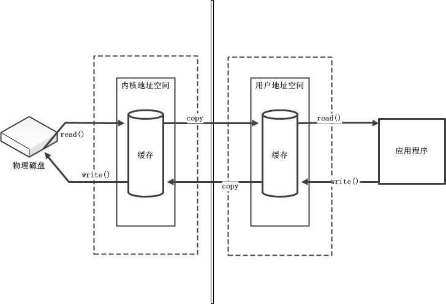
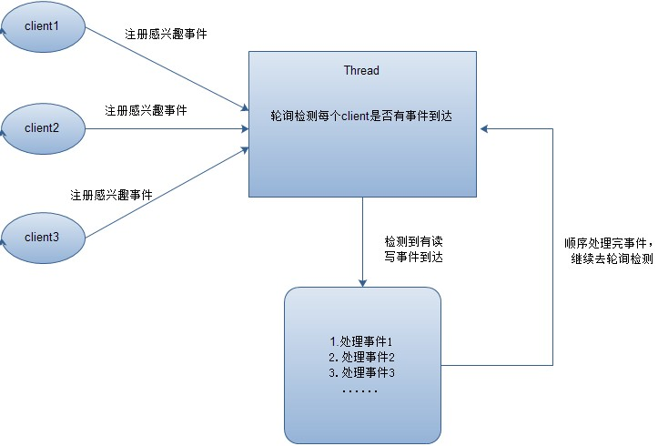
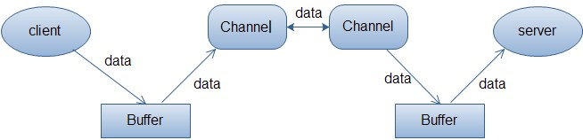

# 浅析I/O模型及NIO的实现

### 同步与异步的区别

- 同步：如果有多个任务或者事件要发生，这些任务或者事件必须逐个地进行，一个事件或者任务的执行**会导致整个流程的暂时等待**，这些事件没有办法并发地执行；
- 异步：如果有多个任务或者事件发生，这些事件可以并发地执行，一个事件或者任务的执行**不会导致整个流程的暂时等待**。

### 阻塞与非阻塞的区别

- 阻塞：当某个事件或者任务在执行过程中，它发出一个请求操作，但是由于该请求操作需要的条件不满足，那么就**会一直在那等待，直至条件满足**；
- 非阻塞：当某个事件或者任务在执行过程中，它发出一个请求操作，如果该请求操作需要的条件不满足，**会立即返回一个标志信息告知条件不满足，不会一直在那等待**。
- 阻塞和非阻塞的区别关键在于**当发出请求一个操作时，如果条件不满足，是会一直等待还是返回一个标志信息**。

### 阻塞IO与非阻塞IO

当用户线程发起一个IO请求操作（以本文读请求操作为例），内核会去查看要读取的数据是否就绪，对于**阻塞IO**来说，如果数据没有就绪，则会**一直在那等待**，直到数据就绪；对于**非阻塞IO**来说，如果数据没有就绪，则会**返回一个标志信息告知用户线程当前要读的数据没有就绪**。

当数据就绪之后，便将数据拷贝到用户线程，这样才完成了一个完整的IO读请求操作，也就是说一个完整的IO读请求操作包括两个阶段：　　
1. 查看数据是否就绪；　　
2. 进行数据拷贝（内核将数据拷贝到用户线程）。



阻塞（`blocking IO`）和非阻塞（`non-blocking IO`）的区别就在于第一个阶段，**如果数据没有就绪，在查看数据是否就绪的过程中是一直等待，还是直接返回一个标志信息**。

Java中传统的IO都是阻塞IO，比如通过`socket`来读数据，调用`read()`方法之后，如果数据没有就绪，当前线程就会一直**阻塞在read方法**调用那里，直到有数据才返回；而如果是非阻塞IO的话，当数据没有就绪，`read()`方法应该**返回一个标志信息**，告知当前线程数据没有就绪，而不是一直在那里等待。

**阻塞IO和非阻塞IO是反映在IO操作的第一个阶段，在查看数据是否就绪时是如何处理的。**

### 同步IO与异步IO的区别

- 同步IO：当用户发出IO请求操作之后，如果数据没有就绪，需要**通过用户线程或者内核不断地去轮询数据是否就绪**，当数据就绪时，再将数据从内核拷贝到用户线程；
- 异步IO：只有IO请求操作的发出是由用户线程来进行的，**IO操作的两个阶段都是由内核自动完成**，然后发送通知告知用户线程IO操作已经完成。也就是说在异步IO中，不会对用户线程产生任何阻塞。

**同步IO和异步IO的关键区别反映在数据拷贝阶段是由用户线程完成还是内核完成。所以说异步IO必须要有操作系统的底层支持**。

## 五种IO模型

### 阻塞IO模型（BIO）

-数据的读取写入必须阻塞在一个线程内等待其完成。

### 非阻塞IO模型

**用户线程需要不断地询问内核数据是否就绪**，一旦内核中的数据准备好了，并且又再次收到了用户线程的请求，那么它马上就将数据拷贝到了用户线程，然后返回。

典型的非阻塞IO模型：
```java
while(true){
    data = socket.read();
    if(data!= error){
        // 处理数据
        break;
    }
}
```

对于非阻塞IO就有一个非常严重的问题，在`while`循环中需要不断地去询问内核数据是否就绪，这样会**导致CPU占用率非常高**，因此一般情况下很少使用`while`循环这种方式来读取数据。

### 多路复用IO模型（NIO）
用一个线程不断去轮询多个`socket`的状态，**只有当socket真正有读写事件时**，才真正调用实际的IO读写操作。

在多路复用IO模型中，**只需要使用一个线程就可以管理多个socket**，并且只有在真正有`socket`读写事件进行时，才会使用IO资源，所以它大大减少了资源占用。

**多路复用IO为何比非阻塞IO模型的效率高**，因为在**非阻塞IO中**，不断地询问socket状态时通过用户线程去进行的，而在**多路复用IO中**，轮询每个`socket`状态是内核在进行的，这个效率要比用户线程要高的多。

多路复用IO模型是通过轮询的方式来检测是否有事件到达，并且对到达的事件逐一进行响应。因此对于多路复用IO模型来说，一旦事件响应体很大，那么就会**导致后续的事件迟迟得不到处理，并且会影响新的事件轮询。**

### 信号驱动IO模型

用户线程发起一个IO请求操作，会**给对应的socket注册一个信号函数**，然后用户线程会继续执行，当内核数据就绪时会发送一个信号给用户线程，用户线程接收到信号之后，便**在信号函数中调用IO读写操作来进行实际的IO请求操作。**

### 异步IO模型 (Asynchronous IO --- AIO)

用户线程发起`read`操作之后，立刻就可以开始去做其它的事。而另一方面，从**内核的角度**，当它收到一个`asynchronous read`之后，它会立刻返回，说明`read`请求已经成功发起了，内核会等待数据准备完成，然后将数据拷贝到用户线程，之后**内核会给用户线程发送一个信号**，告诉它`read`操作完成了。也就说用户线程完全不需要实际的整个IO操作是如何进行的，只需要先发起一个请求，当接收内核返回的成功信号时表示IO操作已经完成，可以直接去使用数据了。

**异步IO模型中，IO操作的两个阶段都不会阻塞用户线程**，这两个阶段都是由内核自动完成，然后发送一个信号告知用户线程操作已完成。**信号驱动模型中，当用户线程接收到信号表示数据已经就绪，然后需要用户线程调用IO函数进行实际的读写操作；**而在异步IO模型中，收到信号表示IO操作已经完成，不需要再在用户线程中调用IO函数进行实际的读写操作。

**注意**，异步IO是需要操作系统的底层支持，在Java 7中，提供了**Asynchronous IO**。

前面四种IO模型实际上都属于同步IO，只有最后一种是真正的异步IO，**因为无论是多路复用IO还是信号驱动模型，IO操作的第2个阶段都会引起用户线程阻塞，也就是内核进行数据拷贝的过程都会让用户线程阻塞。**

## 两种高性能IO设计模式

### 传统的网络服务设计模式中，有两种比较经典的模式

- 多线程模式

来了`client`，服务器就会新建一个线程来处理该`client`的读写事件；

这种模式虽然处理起来简单方便，但是由于服务器为每个`client`的连接都采用一个线程去处理，使得资源占用非常大。因此，当连接数量达到上限时，再有用户请求连接，直接会导致资源瓶颈，严重的可能会直接导致服务器崩溃。

- 线程池模式

创建一个**固定大小的线程池**，来一个客户端，就从线程池取一个空闲线程来处理，当客户端处理完读写操作之后，就交出对线程的占用。因此这样就避免为每一个客户端都要创建线程带来的资源浪费，使得线程可以重用。

线程池的**弊端**，如果连接大多是长连接，因此可能会导致在一段时间内，线程池中的线程都被占用，那么当再有用户请求连接时，由于没有可用的空闲线程来处理，就会导致客户端连接失败，从而影响用户体验。因此，线程池比较适合大量的短连接应用。

### Reactor模式

在`Reactor`模式中，会先对每个`client`注册感兴趣的事件，然后有一个线程专门去轮询每个`client`是否有事件发生，当有事件发生时，便顺序处理每个事件，当所有事件处理完之后，便再转去继续轮询；



**多路复用IO就是采用Reactor模式**。注意，上面的图中展示的 是顺序处理每个事件，当然为了提高事件处理速度，可以通过多线程或者线程池的方式来处理事件。

### Proactor模式

当检测到有事件发生时，会新起一个异步操作，然后交由内核线程去处理，当内核线程完成IO操作之后，发送一个通知告知操作已完成，可以得知，**异步IO模型采用的就是Proactor模式。**


## Java NIO

### Buffer(缓冲区)

在 `Java NIO` 中负责数据的存取。缓冲区就是数组。用于存储不同数据类型的数据。



一个客户端向服务端发送数据，然后服务端接收数据的过程。客户端发送数据时，必须先将数据存入`Buffer`中，然后将`Buffer`中的内容写入通道。服务端这边接收数据必须通过`Channel`将数据读入到`Buffer`中，然后再从Buffer中取出数据来处理。

根据数据类型不同（`boolean`除外），提供了相应类型的缓冲区：`ByteBuffer`、`CharBuffer`、`ShortBuffer`、`IntBuffer`、`LongBuffer`、`FloatBuffer`、`DoubleBuffer`；

缓冲区中的四个核心属性：
- `capacity` : 容量，表示缓冲区中最大存储数据的容量。一旦声明不能改变。
-  `limit` : 界限，表示缓冲区中可以操作数据的大小。（limit 后数据不能进行读写）
- `position` : 位置，表示缓冲区中正在操作数据的位置。

直接缓冲区与非直接缓冲区：
- 非直接缓冲区：通过 `allocate()` 方法分配缓冲区，将缓冲区建立在 `JVM` 的内存中
- 直接缓冲区：通过 `allocateDirect()` 方法分配直接缓冲区，将缓冲区建立在物理内存中。可以提高效率。

```java
public class TestBuffer {
    public void test() {
        //1. 分配一个指定大小的缓冲区
		ByteBuffer buf = ByteBuffer.allocate(1024);
        
        //分配直接缓冲区
		ByteBuffer buf = ByteBuffer.allocateDirect(1024);
        
		//2. 利用 put() 存入数据到缓冲区中
		buf.put(str.getBytes());
		
		//3. 切换读取数据模式
		buf.flip();
		
		//4. 利用 get() 读取缓冲区中的数据
		byte[] dst = new byte[buf.limit()];
		buf.get(dst);
		
		//6. clear() : 清空缓冲区. 但是缓冲区中的数据依然存在，但是处于“被遗忘”状态
		buf.clear();
		System.out.println(buf.position());
		System.out.println(buf.limit());
		System.out.println(buf.capacity());
    }
}
```
### 通道（Channel）

用于源节点与目标节点的连接。在 `Java NIO` 中负责缓冲区中数据的传输。`Channel` 本身不存储数据，因此需要配合缓冲区进行传输。

通道的主要实现类

`java.nio.channels.Channel` 接口：

|--`FileChannel`：可以从文件读或者向文件写入数据
|--`SocketChannel`：以`TCP`来向网络连接的两端读写数据；
|--`ServerSocketChannel`：能够监听客户端发起的TCP连接，并为每个TCP连接创建一个新的SocketChannel来进行数据读写；
|--`DatagramChannel`：以`UDP`协议来向网络连接的两端读写数据；
        
```java
public class Test {
    public static void main(String[] args) throws IOException  {
        File file = new File("data.txt");
        FileOutputStream outputStream = new FileOutputStream(file);
        //获取通道
        FileChannel channel = outputStream.getChannel();
        //分配指定大小的缓冲区
        ByteBuffer buffer = ByteBuffer.allocate(1024);
        String string = "java nio";
        buffer.put(string.getBytes());
        //切换读取数据的模式
        buffer.flip();    // flip方法用于读写模式的切换
        //将缓冲区中的数据写入通道中
        channel.write(buffer);
        channel.close();
        outputStream.close();
    }  
}

```

### 选择器（Selector）

是 `SelectableChannel` 的**多路复用器**。用于监控 `SelectableChannel` 的 IO 状况；

`Selector`类是NIO的**核心类**，`Selector`能够**检测多个注册的通道上是否有事件发生**，如果有事件发生，便获取事件然后针对每个事件进行相应的响应处理。这样一来，只是用一个单线程就可以管理多个通道，也就是管理多个连接。

这样使得只有在连接真正有读写事件发生时，才会调用函数来进行读写，就大大地减少了系统开销，并且不必为每个连接都创建一个线程，不用去维护多个线程，并且避免了多线程之间的上下文切换导致的开销。

```java
public class TestNonBlockingNIO {
	
	//客户端
	@Test
	public void client() throws IOException{
		//1. 获取通道
		SocketChannel sChannel = SocketChannel.open(new InetSocketAddress("127.0.0.1", 9898));
		//2. 切换非阻塞模式
		sChannel.configureBlocking(false);
		//3. 分配指定大小的缓冲区
		ByteBuffer buf = ByteBuffer.allocate(1024);
		//4. 发送数据给服务端
		Scanner scan = new Scanner(System.in);
		while(scan.hasNext()){
			String str = scan.next();
			buf.put((new Date().toString() + "\n" + str).getBytes());
			buf.flip();
			sChannel.write(buf);
			buf.clear();
		}
		//5. 关闭通道
		sChannel.close();
	}
    
	//服务端
	@Test
	public void server() throws IOException{
		//1. 获取通道
		ServerSocketChannel ssChannel = ServerSocketChannel.open();
		//2. 切换非阻塞模式
		ssChannel.configureBlocking(false);
		//3. 绑定连接
		ssChannel.bind(new InetSocketAddress(9898));
		//4. 获取选择器
		Selector selector = Selector.open();
		//5. 将通道注册到选择器上, 并且指定“监听接收事件”
		ssChannel.register(selector, SelectionKey.OP_ACCEPT);
		//6. 轮询式的获取选择器上已经“准备就绪”的事件
		while(selector.select() > 0){
			//7. 获取当前选择器中所有注册的“选择键(已就绪的监听事件)”
			Iterator<SelectionKey> it = selector.selectedKeys().iterator();
			while(it.hasNext()){
				//8. 获取准备“就绪”的是事件
				SelectionKey sk = it.next();
				//9. 判断具体是什么事件准备就绪
				if(sk.isAcceptable()){
					//10. 若“接收就绪”，获取客户端连接
					SocketChannel sChannel = ssChannel.accept();
					//11. 切换非阻塞模式
					sChannel.configureBlocking(false);
					//12. 将该通道注册到选择器上
					sChannel.register(selector, SelectionKey.OP_READ);
				}else if(sk.isReadable()){
					//13. 获取当前选择器上“读就绪”状态的通道
					SocketChannel sChannel = (SocketChannel) sk.channel();
					//14. 读取数据
					ByteBuffer buf = ByteBuffer.allocate(1024);
					int len = 0;
					while((len = sChannel.read(buf)) > 0 ){
						buf.flip();
						System.out.println(new String(buf.array(), 0, len));
						buf.clear();
					}
				}
				//15. 取消选择键 SelectionKey
				it.remove();
			}
		}
	}
}

```