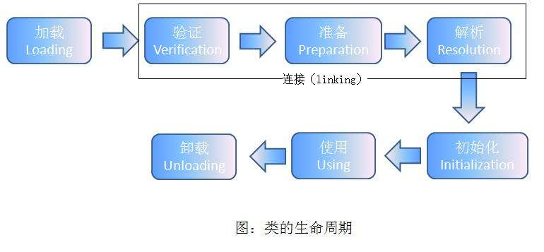
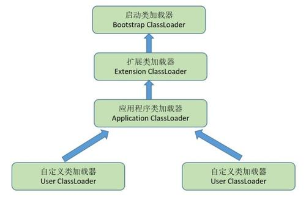

# 虚拟机类加载机制

## 类加载的过程

- 加载

1.  通过一个类的全限定名来获取定义此类的二进制字节流。

2. 将这个字节流所代表的静态存储结构转化为方法区的运行时数据结构。

3. 在内存中生成一个代表这个类的java.lang.Class对象，作为方法区这个类的各种数据的访问入口。

- 验证

确保Class文件的字节流中包含的信息符合当前虚拟机的要求，文件验证、元数据验证、字节码验证、符号引用验证；

- 准备

为类变量分配内存并设置初始值的阶段，这些变量所使用的内存都是在方法区中分配；

- 解析

将常量池内的符号引用替换为直接引用的过程；

- 初始化

初始化阶段就是执行类构造器<clinit>()方法的过程；

## 类加载器

把类加载阶段中的“通过一个类的全限定名来获取描述此类的二进制字节流”这个动作放到了java虚拟机外部去实现，以便让程序自己决定如何获取所需要的类。实现这个动作的代码模板称为“类加载器”。

## 类与类加载器

比价两个类是否”相等“，只有在这两个类是**同一个类加载器加载**的前提下才有意义，否则，即使这两个类来源于同一个Class文件，被同一个虚拟机加载，只要加载他们的类加载器不同，那么这两个类就必定不相等。

## 双清委派模型

> 启动类加载器：负责将存放在<JAVA_HOME>\lib目录中的类库加载到虚拟机内存中。
> 扩展类加载器：负责加载<JAVA_HOME>\lib\ext目录中的所有类库。
> 应用程序类加载器（系统类加载器）：负责加载用户类路径（ClassPath）上所指定的类库，一般情况这个就是程序的默认类加载器。

当一个类收到了类加载请求时: 自己不会首先加载，而是委派给父加载器进行加载，每个层次的加载器都是这样。

所以最终每个加载请求都会经过启动类加载器。只有当父类加载返回不能加载时子加载器才会进行加载。

**双亲委派的好处** : 由于每个类加载都会经过最顶层的启动类加载器，比如 `java.lang.Object`这样的类在各个类加载器下都是同一个类(只有当两个类是由同一个类加载器加载的才有意义，这两个类才相等。)

如果没有双亲委派模型，由各个类加载器自行加载的话。当用户自己编写了一个 `java.lang.Object`类，那样系统中就会出现多个 `Object`，这样 Java 程序中最基本的行为都无法保证，程序会变的非常混乱。

## 破坏双亲委派模型

因为在某些情况下父类加载器需要委托子类加载器去加载class文件。**受到加载范围的限制**，父类加载器无法加载到需要的文件；

以`Driver`接口为例，由于`Driver`接口定义在`jdk`当中的，而其实现由各个数据库的服务商来提供，比如`mysql`的就写了`MySQL Connector`，那么问题就来了，`DriverManager`（也由`jdk`提供）要加载各个实现了`Driver`接口的实现类，然后进行管理;

但是`DriverManager`由启动类加载器加载，只能记载`JAVA_HOME`的`lib`下文件，而其实现是由服务商提供的，由系统类加载器加载，这个时候就需要启动类加载器来获取子类加载器（`上下文加载器`，默认是系统类加载器）来加载`Driver`实现，从而破坏了双亲委派。

