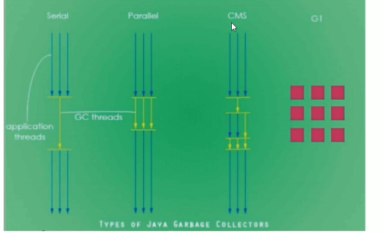
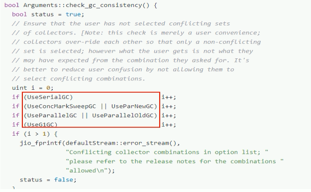
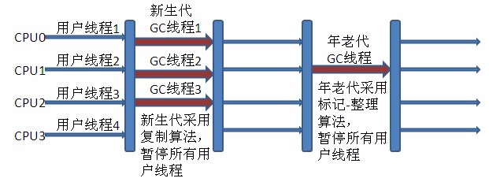
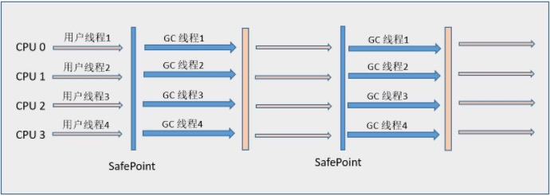
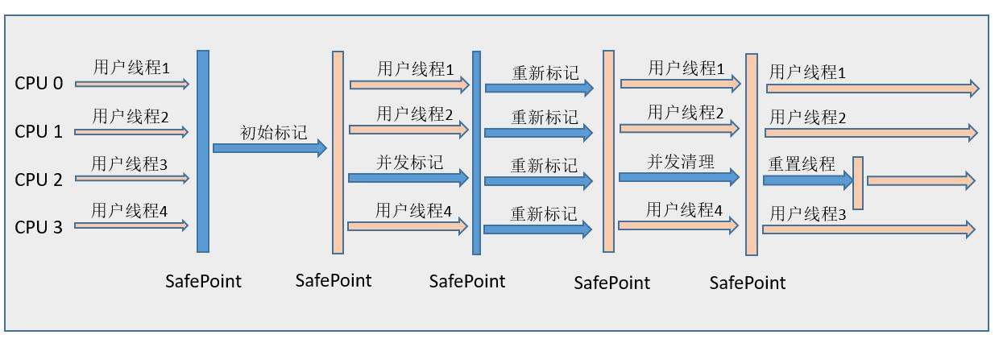
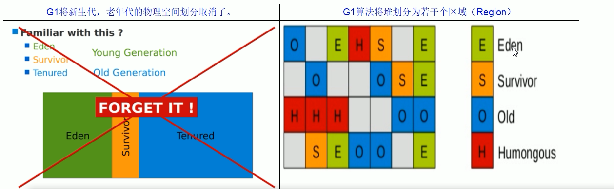
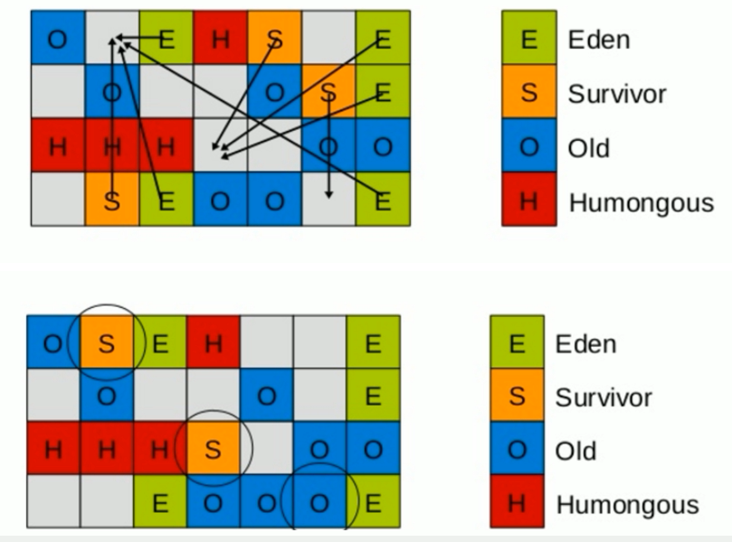
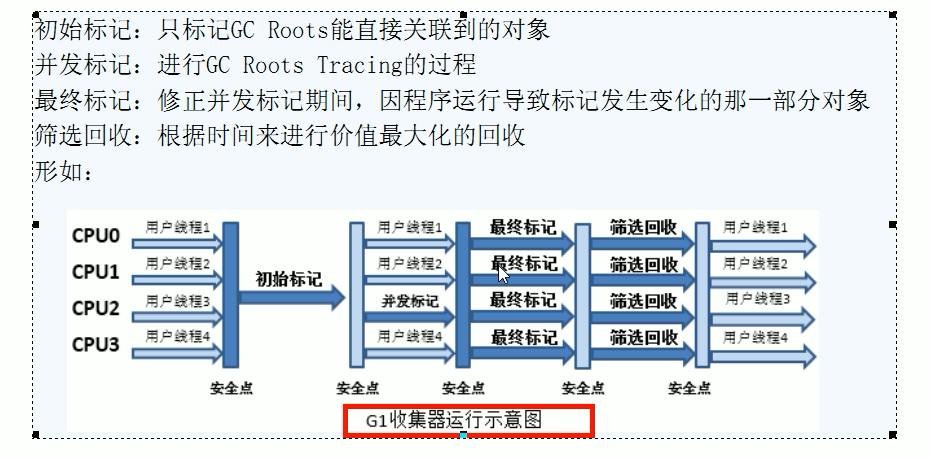

# 垃圾回收

> 垃圾回收主要思考三件事情:

- 哪种内存需要回收？
- 什么时候回收？
- 怎么回收？

## 对象是否存活

### 引用计数法

这是一种非常简单易理解的回收算法。每当有一个地方引用一个对象的时候则在引用计数器上 +1，当失效的时候就 -1，无论什么时候计数器为 0 的时候则认为该对象死亡可以回收了。

这种算法虽然简单高效，但是却无法解决**循环引用**的问题，因此 Java 虚拟机并没有采用这种算法。

### 可达性分析算法
主流的语言其实都是采用可达性分析算法:

可达性算法是通过一个称为 `GC Roots` 的对象向下搜索，整个搜索路径就称为引用链，当一个对象到 `GC Roots` 没有任何引用链 `JVM` 就认为该对象是可以被回收的。

可以用作 `GC-Roots` 的对象有:

- 虚拟机栈中所引用的对象(栈帧中的局部变量区,也叫做局部变量表）。
- 方法区中的类静态属性引用的对象。
- 方法区中常量引用的对象。
- 本地方法栈中(Native方法)引用的对象。

## 垃圾回收算法

### 标记-清除算法

标记清除算法分为两个步骤，标记和清除。
首先将**不需要回收的对象**标记起来，然后再清除其余可回收对象。但是存在两个主要的问题:
- 标记和清除的效率都不高。
- 清除之后容易出现内存碎片，当需要分配一个较大内存时就不得不需要进行一次垃圾回收。

### 复制算法

复制算法是将内存划分为两块大小相等的区域，每次使用时都只用其中一块区域，当发生垃圾回收时会将存活的对象全部复制到未使用的区域，然后对之前的区域进行全部回收。

这样简单高效，而且还不存在标记清除算法中的内存碎片问题，但是需要浪费一个`Survivor` 区大小的内存。

> 在新生代会使用该算法。

新生代中分为一个 `Eden` 区和两个 `Survivor` 区。通常两个区域的比例是 `8:1:1` ，使用时会用到 `Eden` 区和其中一个 `Survivor` 区。当发生回收时则会将还存活的对象从 `Eden` ，`Survivor` 区拷贝到另一个 `Survivor` 区，当该区域内存也不足时则会使用分配担保利用老年代来存放内存。

### 标记整理算法

复制算法如果在存活对象较多时效率明显会降低，特别是在老年代中并没有多余的内存区域可以提供内存担保。

所以老年代中使用的时候`标记整理算法`，它的原理和`标记清除算法`类似，只是最后一步的清除改为了将存活对象全部移动到一端，然后再将边界之外的内存全部回收。

### 分代回收算法
现代多数的商用 `JVM` 的垃圾收集器都是采用的分代回收算法，和之前所提到的算法并没有新的内容。

只是将 Java 堆分为了新生代和老年代。由于新生代中存活对象较少，所以采用**复制算法**，简单高效。

而老年代中对象较多，并且没有可以担保的内存区域，所以一般采用**标记清除或者是标记整理算法**。

## 垃圾收集器

- 串行垃圾回收器（Serial）

它为单线程环境设计并且只使用一个线程进行垃圾回收，会暂停所有的用户线程。所以不适合服务器环境；

- 并行垃圾回收器（Parallel）

多个垃圾回收线程并行工作，此时用户线程是暂停的，适用于科学计算/大数据处理等弱交互场景；

- 并发垃圾回收器（CMS）

用户线程和垃圾收集线程同时执行（不一定是并行，可能交替执行），不需要停顿用户线程，互联网公司多用它，适用于对响应时间有要求的场景；

- G1垃圾回收器

G1垃圾回收器将堆内存分割成不同的区域然后并发的对其进行垃圾回收；

查看默认的垃圾收集器
> java -XX:+PrintCommandLineFlags -version

Java GC 回收类型：UseSerialGC、UseParallelGC、UseConcMarkSweepGC、UseParNewGC、UseG1GC

### Serial 收集器

单线程收集器，在进行垃圾收集时，必须暂停其他的工作线程，直到收集结束。

对应的JVM参数：`-XX:+UseSerialGC`

开启后会使用：Serial（Yong区用）+ Serial Old（Old区用）的收集器组合。

### ParNew 收集器

`Serial`收集器的多线程版本，使用多线程进行垃圾回收；最常见的场景配合老年代的`CMS GC`工作；

对应的JVM参数：`-XX:+UseParNewGC`

开启后会使用：ParNew（Yong区用）+ Serial Old的收集器组合。（Java8已经不再推荐使用）

备注：
`-XX:ParallelGCThreads=N` 参数限制线程的数量，默认开启和CPU数目相同的线程数。
> CPU > 8	N = 5/8
> CPU < 8	N = 实际的个数

### Parallel scavenge 收集器

类似`ParNew`也是一个新生代垃圾收集器，使用复制算法，也是一个并行的多线程的垃圾收集器。俗称**吞吐量优先收集器**；一句话：串行收集器在新生代和老年代的并行化。

它关注的是**可控制的吞吐量**（Thoughput=运行用户代码时间/（运行用户代码时间+垃圾收集时间）。高吞吐量意味着高效利用CPU的时间，它多用于后台运算而不需要太多交互的任务。

对应JVM参数：`-XX:+UseparallelGC` 或 `-XX:+UseparallelOldGC` （可以相互激活）

### CMS（Concurrent Mark Sweep）收集器

是一种以获得最短回收停顿时间为目标的收集器。

采用标记清除算法，会产生内存碎片。

适合应用在互联网站或者B/S系统服务器上，这类应用尤其重视服务器的响应速度，希望系统停顿时间最短。

CMS非常适合堆内存大、CPU核数多的服务器端应用。

开启该收集器的JVM参数：`-XX:+UseConcMarkSweepGC`，开启该参数后会自动将`-XX:+UseParNewGC`打开；

使用ParNew（Yong区用）+ CMS（Old区用）+ Serial Old的垃圾收集器组合，Serial Old将作为CMS出错的后备收集器。

### G1垃圾回收器

是一款面向服务端应用的收集器。

G1整体上采用标记-整理算法，局部通过复制算法，不会产生内存碎片。

宏观上看G1不在区分新生代和老年代。把内存划分为多个独立的子区域（Region），在小范围内要进行年轻代和老年代的区分，但是它们不再是物理隔离的，而是**一部分Region的集合**，且不需要Region是连续的，也就是说依然会采用不同的GC方式来处理不同的区域。

核心思想：

将整个堆内存区域分成大小相同的子区域（Region），在JVM启动时会自动设置这些子区域的大小，在堆的使用上，**G1并不要求对象的存储一定是物理上连续的只要逻辑上连续即可**，每个分区也不会固定为某个代服务，可以按需在年轻代和老年代之间切换。

回收过程：

针对Eden区进行收集，Eden区耗尽后会被触发，主要是小区域收集+形成连续的内存块，避免内存碎片；

Eden区的数据移动到Survivor区，假如出现Survivor区空间不够，Eden区数据会晋升到Old区；

Survivor区的数据移动到新的Survivor区，部分数据晋升到Old区；

最后Eden区收拾干净了，GC结束，用户的应用程序继续执行。

四步过程：

与CMS相比的优势：

1. G1不会产生内存碎片。
2. 是可以精准控制停顿。每次根据允许停顿的时间去收集垃圾最多的区域。

### 如何选择垃圾收集器

- 单CPU或小内存，单机程序
Serial + Serial Old
- 多CPU，需要最大吞吐量，如后台计算型应用
Parallel + Parallel Old
- 多CPU，追求低停顿时间，需要快速响应，如互联网应用
ParNew + CMS

