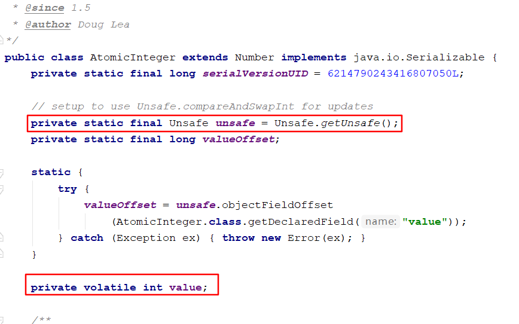
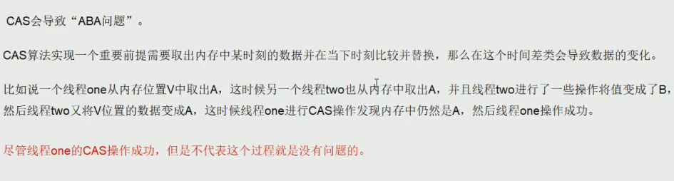

# CAS 底层原理

体验一把原子类中的CAS操作
```java
public class CASDemo {
    public static void main(String[] args) {
        AtomicInteger atomicInteger = new AtomicInteger(5);
        System.out.println(atomicInteger.compareAndSet(5, 2019)+"\t current"+atomicInteger.get());
        System.out.println(atomicInteger.compareAndSet(5, 2014)+"\t current"+atomicInteger.get());
    }
}
```

## UnSafe类

在了解CAS之前，先了解UnSafe类；

atomicInteger.getAndIncrement()方法的源代码:
```java
/**
 * Atomically increments by one the current value.
 *
 * @return the previous value
 */
public final int getAndIncrement() {
    return unsafe.getAndAddInt(this, valueOffset, 1);
}
```



1. `UnSafe`是CAS的核心类 由于Java 方法无法直接访问底层 ,需要通过本地(native)方法来访问,UnSafe相当于一个后面,基于该类可以直接操作特额定的内存数据.

**UnSafe类在于sun.misc包中**,其内部方法操作可以向C的指针一样直接操作内存,因为Java中CAS操作的助兴依赖于UnSafe类的方法.

**注意UnSafe类中所有的方法都是native修饰的,也就是说UnSafe类中的方法都是直接调用操作底层资源执行响应的任务**

2. 变量`valueoffset`,便是该变量在内存中的偏移地址,因为UnSafe就是根据内存偏移地址获取数据的;

```java
/**
 * Atomically increments by one the current value.
 *
 * @return the previous value
 */
public final int getAndIncrement() {
    return unsafe.getAndAddInt(this, valueOffset, 1);
}
```

3.变量value用volatile修饰,保证了多线程之间的可见性.


## CAS 
- **CAS的全称为Compare-And-Swap ,它是一条CPU并发原语**.

它的功能是判断内存某个位置的值是否为预期值,如果是则更新为新的值,这个过程是原子的；

CAS并发原语体现在Java语言中就是sun.misc.**UnSaffe**类中的各个方法。

调用UnSafe类中的CAS方法,JVM会帮我实现**CAS汇编指令**.这是一种完全依赖于**硬件** 功能，通过它实现了原子操作,再次强调,由于CAS是一种系统原语,原语属于操作系统用于范畴,是由若干条指令组成,用于完成某个功能的一个过；

**并且原语的执行必须是连续的,在执行过程中不允许中断,也即是说CAS是一条原子指令,不会造成所谓的数据不一致的问题**.

unSafe.getAndIncrement源码分析：

> var1 AtomicInteger对象本身.
> var2 该对象值的引用地址
> var4 需要变动的数值
> var5 是用过var1 var2找出内存中绅士的值
> 用该对象当前的值与var5比较
> 如果相同,更新var5的值并且返回true
> 如果不同,继续取值然后比较,直到更新完成

```java

/**
 * Atomically increments by one the current value.
 *
 * @return the previous value
 */
public final int getAndIncrement() {
    return unsafe.getAndAddInt(this, valueOffset, 1);
}


public final int getAndAddInt(Object paramObject, long paramLong, int paramInt)
{
  int i;
  do
    i = getIntVolatile(paramObject, paramLong);
  while (!compareAndSwapInt(paramObject, paramLong, i, i + paramInt));
  return i;
}
```

> 假设线程A和线程B两个线程同时执行getAndAddInt操作(分别在不同的CPU上):
>  
> 1.AtomicInteger里面的value原始值为3,即主内存中AtomicInteger的value为3,根据JMM模型,线程A和线程B各自持有一份值为3的value的副本分别到各自的工作内存.
>  
> 2.线程A通过getIntVolatile(var1,var2) 拿到value值3,这是线程A被挂起.
>  
> 3.线程B也通过getIntVolatile(var1,var2) 拿到value值3,此时刚好线程B没有被挂起并执行compareAndSwapInt方法比较内存中的值也是3 成功修改内存的值为4 线程B打完收工 一切OK.
>  
> 4.这是线程A恢复,执行compareAndSwapInt方法比较,发现自己手里的数值和内存中的数字4不一致,说明该值已经被其他线程抢先一步修改了,那A线程修改失败,只能重新来一遍了.
>  
> 5.线程A重新获取value值,因为变量value是volatile修饰,所以其他线程对他的修改,线程A总是能够看到,线程A继续执行compareAndSwapInt方法进行比较替换,直到成功.

## CAS 的缺点
1. 循环时间长开销很大；

2. 只能保证一个共享变量的原子性；

3. 引出来ABA问题；

## 解决 ABA 问题

ABA问题的产生：



可以通过版本号来解决ABA问题。操作变量时从主内存拷贝变量到工作内存，同时要获取到版本号，当修改完变量写回主内存时，需要将获得的版本号与变量在主内存中的版本号比较，若大于或等于，则将值写回主内存，将版本号加1，否则，必须重新拷贝主内存中的值。

Java中提供了现成的带时间戳的原子引用类`AtomicStampedReference`;

```java
/**
 * Description: ABA问题的解决
 **/
public class ABADemo {
	// 原子引用类
    private static AtomicReference<Integer> atomicReference=new AtomicReference<>(100);

	// 带时间戳的原子引用类
    private static AtomicStampedReference<Integer> stampedReference=new AtomicStampedReference<>(100,1);
	
    public static void main(String[] args) {
        System.out.println("===以下是ABA问题的产生===");
        new Thread(()->{
            atomicReference.compareAndSet(100,101);
            atomicReference.compareAndSet(101,100);
        },"t1").start();

        new Thread(()->{
            //先暂停1秒 保证完成ABA
            try { TimeUnit.SECONDS.sleep(1); } catch (InterruptedException e) { e.printStackTrace(); }
			
            System.out.println(atomicReference.compareAndSet(100, 2019)+"\t"+atomicReference.get());
        },"t2").start();
		
        try { TimeUnit.SECONDS.sleep(2); } catch (InterruptedException e) { e.printStackTrace(); }
		
		
        System.out.println("===以下是ABA问题的解决===");

        new Thread(()->{
			// 查看当前版本号
            int stamp = stampedReference.getStamp();
            System.out.println(Thread.currentThread().getName()+"\t 第1次版本号"+stamp+"\t值是"+stampedReference.getReference());
            
			//暂停1秒钟t3线程
            try { TimeUnit.SECONDS.sleep(1); } catch (InterruptedException e) { e.printStackTrace(); }
			// 更新值
            stampedReference.compareAndSet(100,101,stampedReference.getStamp(),stampedReference.getStamp()+1);
            
			System.out.println(Thread.currentThread().getName()+"\t 第2次版本号"+stampedReference.getStamp()+"\t值是"+stampedReference.getReference());
			
			// 更新值
			stampedReference.compareAndSet(101,100,stampedReference.getStamp(),stampedReference.getStamp()+1);
			
            System.out.println(Thread.currentThread().getName()+"\t 第3次版本号"+stampedReference.getStamp()+"\t值是"+stampedReference.getReference());
        },"t3").start();

        new Thread(()->{
            int stamp = stampedReference.getStamp();
            System.out.println(Thread.currentThread().getName()+"\t 第1次版本号"+stamp+"\t值是"+stampedReference.getReference());
            
			//保证线程3完成1次ABA
            try { TimeUnit.SECONDS.sleep(3); } catch (InterruptedException e) { e.printStackTrace(); }
			
			// 更新值
            boolean result = stampedReference.compareAndSet(100, 2019, stamp, stamp + 1);
            
			System.out.println(Thread.currentThread().getName()+"\t 修改成功否"+result+"\t最新版本号"+stampedReference.getStamp());
            System.out.println("最新的值\t"+stampedReference.getReference());
        },"t4").start();
    }
}
```


