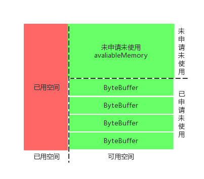
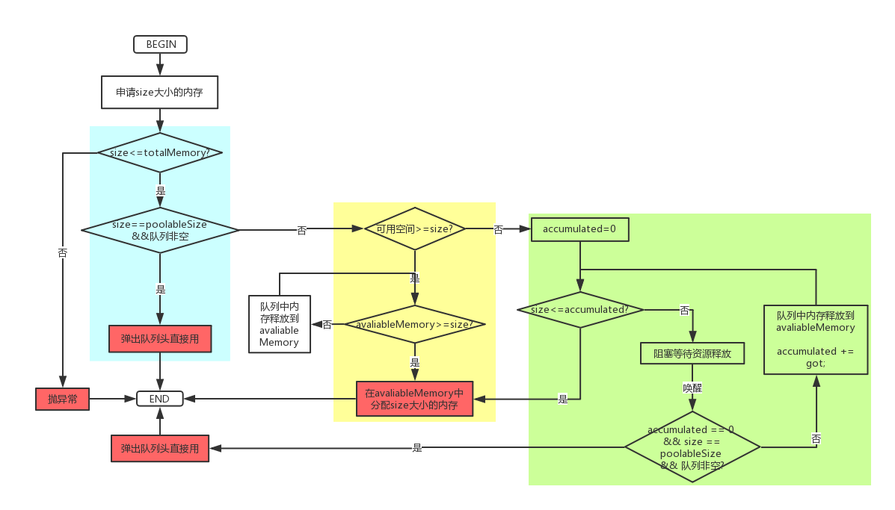

# KafkaProducer内存管理

`kafka`生产者`send`一条记录(`record`)后并没有直接发送到`broker`，而是先将它保存到内存(`RecordAccumulator`)中，用于压缩之后批量发送，这里内存直接分配在堆上，如果对它不加以限制在消息生产速率足够高时很可能频繁出现`fullgc`乃至`oom`，另一方面频繁的内存申请和释放操作也很吃系统资源，因此`Kafka`自建了内存池`BufferPool`管理内存。

## ByteBuffer 介绍

内存的创建和释放是比较消耗资源的，为了实现内存的高效利用，`kafka`的生产者使用`BufferPool`来实现内存(`ByteBuffer`)的复用。



红色和绿色的总和代表`BufferPool`的总量，用`totalMemory`表示(由`buffer.memory`配置)；绿色代表可使用的空间，它又包括两个部分：上半部分代表未申请未使用的部分，用`availableMemory`表示；下半部分代表已经申请但没有使用的部分，用一个`ByteBuffer`队列(`Deque<ByteBuffer>`)表示，我们称这个队列为`free`，队列中的`ByteBuffer`的大小用`poolableSize`表示(由`batch.size`配置)。

```java
public class BufferPool {
    private final long totalMemory;
    private final int poolableSize;
    private final ReentrantLock lock;
    private final Deque<ByteBuffer> free;
    private final Deque<Condition> waiters;
    /** Total available memory is the sum of nonPooledAvailableMemory and the number of byte buffers in free * poolableSize.  */
    private long nonPooledAvailableMemory;
    private final Metrics metrics;
    private final Time time;
    private final Sensor waitTime;
}
```

## 内存分配的过程



1. 蓝色框内的为大多数的内存分配方式，就是从队列中直接拿想要的`ByteBuffer`；

2. 黄色的框为分配内存时队列中的内存不符合其分配的条件（队列为空或大小不匹配），从`availableMemory`中分配；

3. 绿色框为当前内存池中内存不足时阻塞等待的情况，具体就是有一个累加器`accumulated`，如果累加器没有累加到`size`大小，说明还没有足够的内存释放出来，所以就会阻塞等待内存释放，内存释放之后会唤醒阻塞的线程，将可以分配的内存大小累加到累加器`accumulated`上，这样直到累加器`accumulated`大小满足`size`，就直接分配。这里面还有一个原则就是如果还没给累加器`accumulated`累加过一次的话，也就是`accumulated==0`的时候，那么会优先尝试从队列中获取内存（有可能释放的内存释放到队列中）。

```java
public ByteBuffer allocate(int size, long maxTimeToBlockMs) throws InterruptedException {
    if (size > this.totalMemory)   throw new IllegalArgumentException();

    ByteBuffer buffer = null;
    this.lock.lock();
    try {
        // 1. 需要的内存大小ByteBuffer内存池中有，直接出队一个
        if (size == poolableSize && !this.free.isEmpty())
            return this.free.pollFirst();
				// 2 可用内存大于size，则从内存池中释放内存到nonPooledAvailableMemory中，直接分配size大小的内存
        int freeListSize = freeSize() * this.poolableSize;
        if (this.nonPooledAvailableMemory + freeListSize >= size) {
            // 循环的释放内存池中的内存，直到nonPooledAvailableMemory大于size
            freeUp(size); 
            this.nonPooledAvailableMemory -= size;
        } else {
            // 当前可用内存不足，需要阻塞用户线程，等待内存释放
            int accumulated = 0;
            Condition moreMemory = this.lock.newCondition();
            try {
                long remainingTimeToBlockNs = TimeUnit.MILLISECONDS.toNanos(maxTimeToBlockMs);
                this.waiters.addLast(moreMemory);
                while (accumulated < size) {
                    long startWaitNs = time.nanoseconds();
                    long timeNs;
                    boolean waitingTimeElapsed;
                    try {
                      // 阻塞，等待数据发送释放内存
                        waitingTimeElapsed = !moreMemory.await(remainingTimeToBlockNs, TimeUnit.NANOSECONDS);
                    } finally {
                        long endWaitNs = time.nanoseconds();
                        timeNs = Math.max(0L, endWaitNs - startWaitNs);
                        recordWaitTime(timeNs);
                    }
                    if (waitingTimeElapsed) {
                        throw new TimeoutException();
                    }
                    remainingTimeToBlockNs -= timeNs;
										// 满足的话直接从内存池中释放
                    if (accumulated == 0 && size == this.poolableSize && !this.free.isEmpty()) {
                        buffer = this.free.pollFirst();
                        accumulated = size;
                    } else {
                      	// 从内存池和nonPooledAvailableMemory进行累加内存	
                        freeUp(size - accumulated);
                        int got = (int) Math.min(size - accumulated, this.nonPooledAvailableMemory);
                        this.nonPooledAvailableMemory -= got;
                        accumulated += got;
                    }
                }
                accumulated = 0;
            } finally {
                this.nonPooledAvailableMemory += accumulated;
                this.waiters.remove(moreMemory);
            }
        }
    } finally {
        try {
            if (!(this.nonPooledAvailableMemory == 0 && this.free.isEmpty()) && !this.waiters.isEmpty())
                this.waiters.peekFirst().signal();
        } finally {
            lock.unlock();
        }
    }
    if (buffer == null)
      // 直接分配size大小的内存
        return safeAllocateByteBuffer(size);
    else
        return buffer;
}
```

释放内存的话就比较简单了，如果释放的大小等于`poolableSize`的话，就把它放入`free`队列，否则释放到`availableMemory`中(`availableMemory+=size`)。所以只有固定大小的内存块被释放后才会进入池化列表，非常规释放后只会增加可用内存大小，而释放内存则由虚拟机回收。因此如果超大消息比较多，依然有可能会引起`full gc`乃至`oom` ;

`BufferPool`是线程安全的，用一个`ReentrantLock`来保证，并且用一个`Deque<Condition> waiters`队列来记录申请不到足够空间而阻塞的线程，此队列中实际记录的是阻塞线程对应的`Condition`对象。

可以看到`BufferPool`只针对特定大小(`poolableSize`)的`ByteBuffer`进行管理，对于其它大小的并不会缓存进来。因此如果超大消息比较多(大于`poolableSize`)，就不会很好的利用内存池，频繁的申请回收内存效率会降低，并可能带来`full GC`或者`oom`，这个时候就要调整好`batch.size`的配置了。

## 批量管理

`batch`创建后会逗留`linger.ms`时间，它集聚该段时间内属于该分区的消息。如果生产速率特别高又或者有超大消息流入很快将分区打满，则实际逗留时间会低于`linger.ms`。想象一下极端场景，`batch`大小默认`16k`，如果消息以`5k`、`12k`间隔发，则内存实际利用率只有`（5+12）/(2*16)`。

另一方面，`RecordAccumulator`挤出前先要做就绪节点检查，挤出动作也只针对`leader`在这些节点上的分区批次，当节点`ready to drain`后，可能因为连接或者`inflightRequests`超限等问题，被从发送就绪列表移除，从而导致这些节点的可发送批次不会被挤出。它们始终占据分区队列的最高挤出优先级，这会导致：

1. 后追加的消息被积压，即使连接恢复后新入的消息也只能等待顺序处理，整体投递延时猛增。
2. 批次占据的内存得不到释放，有可能发生雪崩：因为只有追加没有挤出，问题节点的批次有可能占满全部内存空间导致其他正常节点分区无法为新批次申请空间。

`Kafka`提供请求超时`timeout.ms`解决这个问题，从逗留截止开始计算批次超时则被废弃–释放内存空间并从分区队列移除。

**理想状况下，单位时间内追入和挤出应该恰好相等且内存被充分使用。长期观察下调好linger.ms、batch.size、timeout.ms、和buffer.memory这几个参数将有助于达到这个目标。**

[Kafka Producer 默认参数](https://www.jianshu.com/p/72fdad032bb5)