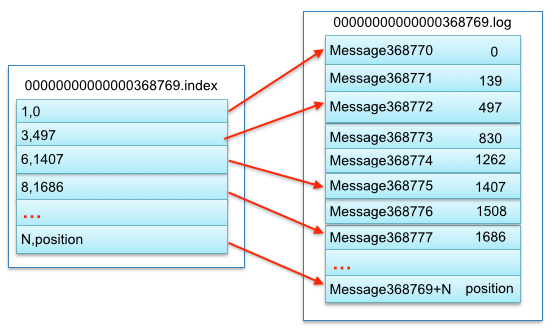
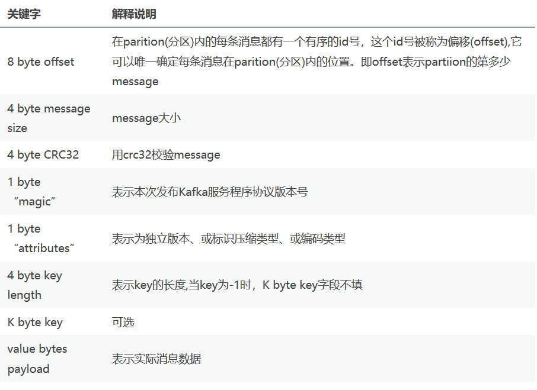

# kafka的数据存储

### kafka数据的存储方式

> Broker：消息中间件处理结点，一个Kafka节点就是一个broker，多个broker可以组成一个Kafka集群；
> Topic：一类消息，例如page view日志、click日志等都可以以topic的形式存在，Kafka集群能够同时负责多个topic的分发；
> Partition：topic物理上的分组，一个topic可以分为多个partition，每个partition是一个有序的队列；
> Segment：每个partition又由多个segment file组成；   
>
> offset：每个partition都由一系列有序的、不可变的消息组成，这些消息被连续的追加到partition中。partition中的每个消息都有一个连续的序列号叫做offset，用于partition唯一标识一条消息；
> message：这个算是kafka文件中最小的存储单位，即是 a commit log。

**partition中的数据文件**:

一个`partition`（在`Broker`中以文件夹的形式存在），里面又有很多大小相等的`segment`数据文件（这个文件的具体大小可以在`config/server.properties`中进行设置），这种特性可以方便`old segment file`的快速删除。

**segment file 组成**：

由2部分组成，分别为`index file`和`data file`，这两个文件是一一对应的，后缀`.index`和`.log`分别表示索引文件和数据文件；

命名规则：`partition`的第一个`segment`从0开始，后续每个`segment`文件名为上一个`segment`文件最后一条消息的`offset`,`ofsset`的数值最大为64位（long类型），20位数字字符长度，没有数字用0填充。

`segment file`中`index`与`data file`对应关系图:

### 消息(message)格式

### kafka如何通过offset查找message

1. **数据文件的分段**,每段放在一个单独的数据文件里面，数据文件以该段中最小的`offset`命名。这样在查找指定`offset`的`Message`的时候，用二分查找就可以定位到该`Message`在哪个段中。
2. **为数据文件建索引**,索引包含两个部分（均为4个字节的数字），分别为相对`offset`和`position`。
3. **通过offset查找message**
假如我们想要读取`offset`=368776的`message`，需要通过下面2个步骤查找。
	1. 通过offeset定位到`segment file`;
	2. 通过`segment file`找到索引文件，定位到指定的`offset`，找到该`message`在数据文件中对应的偏移量；
	3. 通过移动指针定位到`message`;

`segment index file`并没有为数据文件中的每条message建立索引，而是采取**稀疏索引**存储方式，每隔一定字节的数据建立一条索引，它减少了索引文件大小，但查找起来需要消耗更多的时间。

### 总结

Kafka高效文件存储设计特点：

- `Kafka`把`topic`中一个`parition`大文件分成多个小文件段，通过多个小文件段，就容易定期清除或删除已经消费完文件，减少磁盘占用。
- 通过索引信息可以快速定位`message`和确定`response`的最大大小。
- 通过`index`元数据全部映射到`memory`，可以避免`segment file`的`IO`磁盘操作。
- 通过索引文件稀疏存储，可以大幅降低`index`文件元数据占用空间大小。

