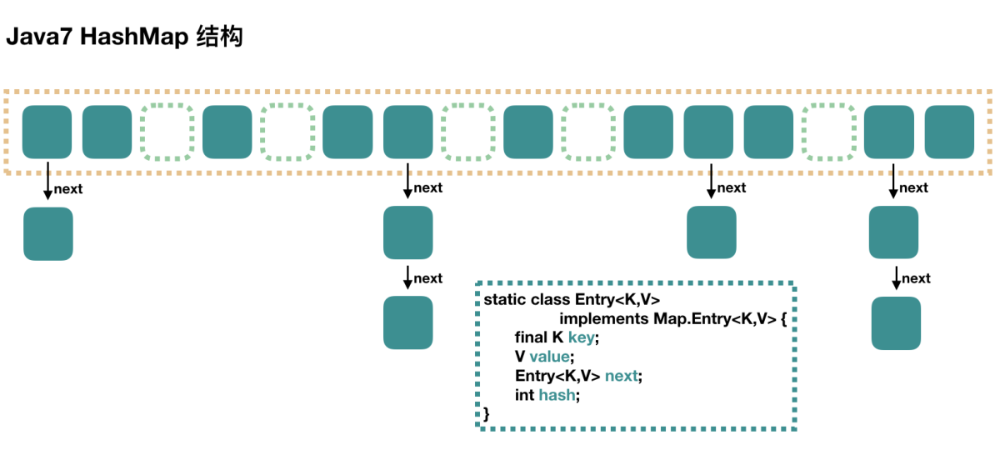
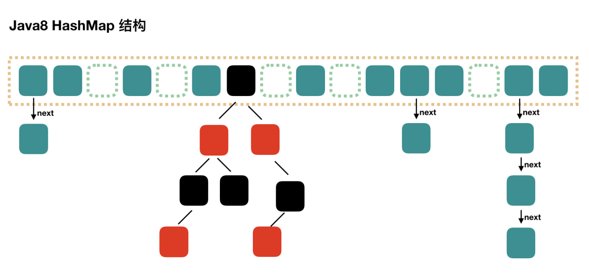
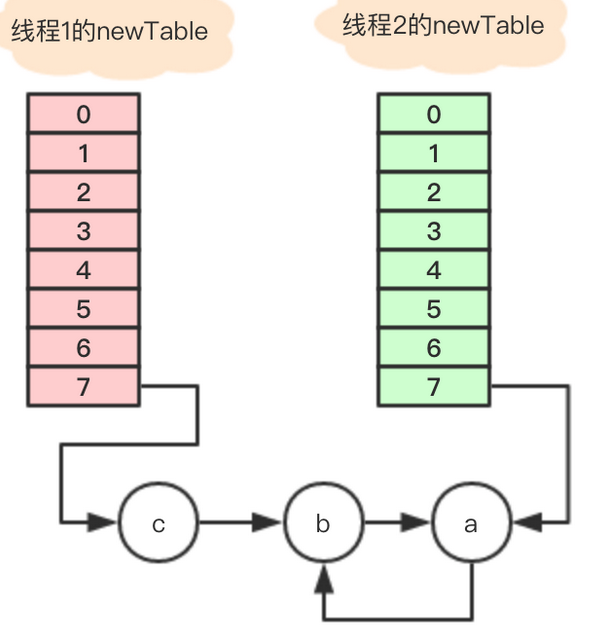

# HashMap 底层分析

## Java7 HashMap



如图所示，HashMap 底层是基于数组和链表实现的。其中有两个重要的参数：

- 容量(Capacity)
- 负载因子(loadFactor)
- 扩容阈值(threshold)

容量的默认大小是 16，负载因子是 0.75，当 `HashMap` 的 `size > 16*0.75` 时就会发生扩容(容量和负载因子都可以自由调整)。

### put 方法
首先会将传入的 Key 做 `hash` 运算计算出 hashcode,然后根据数组长度取模计算出在数组中的 index 下标。

由于在计算中位运算比取模运算效率高的多，所以 HashMap 规定数组的长度为 `2^n` 。这样用 `2^n - 1` 做位运算与取模效果一致，并且效率还要高出许多。

由于数组的长度有限，所以难免会出现不同的 Key 通过运算得到的 index 相同，这种情况可以利用链表来解决，HashMap 会在 `table[index]`处形成链表，采用头插法将数据插入到链表中。

### get 方法

get 和 put 类似，也是将传入的 Key 计算出 index ，如果该位置上是一个链表就需要遍历整个链表，通过 `key.equals(k)` 来找到对应的元素。

### 遍历方式


```java
 Iterator<Map.Entry<String, Integer>> entryIterator = map.entrySet().iterator();
        while (entryIterator.hasNext()) {
            Map.Entry<String, Integer> next = entryIterator.next();
            System.out.println("key=" + next.getKey() + " value=" + next.getValue());
        }
```

```java
Iterator<String> iterator = map.keySet().iterator();
        while (iterator.hasNext()){
            String key = iterator.next();
            System.out.println("key=" + key + " value=" + map.get(key));

        }
```

```java
map.forEach((key,value)->{
    System.out.println("key=" + key + " value=" + value);
});
```

**强烈建议**使用第一种 EntrySet 进行遍历。

第一种可以把 key value 同时取出，第二种还得需要通过 key 取一次 value，效率较低, 第三种需要 `JDK1.8` 以上，通过外层遍历 table，内层遍历链表或红黑树。 


## Java8 HashMap



Java7中使用Entry来代表每个HashMap中的数据节点, Java8中使用Node,基本没有区别,都是key, value, hash和next这四个属性。

不过, Node只能用于链表的情况,红黑树的情况需要使用TreeNode我们根据数组元素中,第一个节点数据类型是Node还是TreeNode来判断该位置下是链表还是红黑树的。

当 `hash` 碰撞之后写入链表的长度超过了阈值(默认为8)并且 `table` 的长度不小于64(否则扩容一次)时，链表将会转换为**红黑树**。

假设 `hash` 冲突非常严重，一个数组后面接了很长的链表，此时重新的时间复杂度就是 `O(n)` 。

如果是红黑树，时间复杂度就是 `O(logn)` 。大大提高了查询效率。

具体的代码就不写出来了。

## notice

在并发环境下使用 `HashMap` 容易出现死循环。

并发场景发生扩容，调用 `resize()` 方法里的 `rehash()` 时，容易出现环形链表。这样当获取一个不存在的 `key` 时，计算出的 `index` 正好是环形链表的下标时就会出现死循环。



> 所以 HashMap 只能在单线程中使用，并且尽量的预设容量，尽可能的减少扩容。
> 多线程场景下推荐使用 `ConcurrentHashMap`;


**更多 HashMap 与 ConcurrentHashMap 相关请查看[这里](https://crossoverjie.top/2018/07/23/java-senior/ConcurrentHashMap/)。**