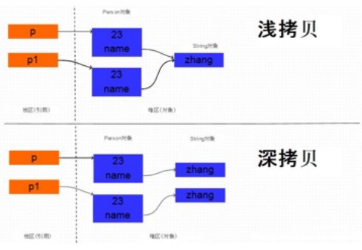

# Java 基础常考知识点

## java中==和equals和hashCode的区别
**基本数据类型**: `==` 比较的值相等

**引用数据类型**: `==` 比较的地址相等

`equals`是Object类中的方法，实现：

```java
public boolean equals(Object obj) {
		// 在不覆盖的情况下比较的就是地址
        return (this == obj);
    }
```

`hashCode`是Object类中的方法,返回的是内存地址；

## Object类
所有类的父类,类加载器第一个加载的类,其中主要的方法:

equals(): 判断两个对象是否具有相同的引用, String重写了方法,主要是内容;

hashCode(): 哈希值,默认是对象存储地址, String类是内容导出;

clone(): 克隆对象;

wait(long timeout): 导致该线程阻塞，该线程不可继续执行，并且该对象上的锁被释放;

notify(): 导致因调用该对象的 wait()方法而阻塞的线程中随机选择的一个解除阻塞（但要等到获得锁后才真正可执行）;

finalize(): 析构函数

## String、StringBuilder和StringBuffer的区别
**String** 是一个**不可变**的类, String类内部是一个char数组和hashcode值。

在修改字符串时,将会new出一个新的字符串,然后将变量指向这块地址。

不可变字符串有一个优点: **编译器可以让字符串共享,如果变量复制,原始字符串与复制字符串共享相同的字符**。

检测字符串相等,使用`equals`方法, `==` 表示字符串是否在同一个位置上(即内存地址是否相同)。

**StringBuilder** 类是一个final修饰的类是线程不安全的,主要用于字符串拼接,在单线程下使用,高效。

**StringBuffer** 类是一个final修饰的类是线程安全的,也是用于字符串拼接,加入`synchronized`关键字,效率低。

## 深拷贝和浅拷贝


上图是浅拷贝和深拷贝。

对于基本类型,进行拷贝不会产生问题,对于复杂类型,例如String,需要自己实现:
1. 实现Cloneable接口在Clone()方法中手动的new出相应的复杂类型。

## 异常
- **检查性异常**：最具代表的检查性异常是用户错误或问题引起的异常，这是程序员无法预见的。这些异常在编译时不能被简单地忽略。如IO异常
- **运行时异常**： 运行时异常是可能被程序员避免的异常。与检查性异常相反，运行时异常可以在编译时被忽略，如空指针异常、数组角标越界。
- **错误**： 错误不是异常，而是脱离程序员控制的问题。错误在代码中通常被忽略。例如，当栈溢出时，一个错误就发生了，它们在编译也检查不到的。

## final，finally，finalize的区别
- final: 修饰类、成员变量和成员方法，类不可被继承，成员变量不可变，成员方法不可重写
- finally: 与try...catch...共同使用，确保无论是否出现异常都能被调用到
- finalize: 类的方法,垃圾回收之前会调用此方法,子类可以重写finalize()方法实现对资源的回收

## Java中线程的状态
>1. 初始(NEW)：新创建了一个线程对象，但还没有调用start()方法。
>2. 运行(RUNNABLE)：Java线程中将就绪（ready）和运行中（running）两种状态笼统的称为“运行”。线程对象创建后，其他线程(比如main线程）调用了该对象的start()方法。该状态的线程位于可运行线程池中，等待被线程调度选中，获取CPU的使用权，此时处于就绪状态（ready）。就绪状态的线程在获得CPU时间片后变为运行中状态（running）。
>3. 阻塞(BLOCKED)：表示线程阻塞于锁。
>4. 等待(WAITING)：进入该状态的线程需要等待其他线程做出一些特定动作（通知或中断）。
>5. 超时等待(TIMED_WAITING)：该状态不同于WAITING，它可以在指定的时间后自行返回。
>6. 终止(TERMINATED)：表示该线程已经执行完毕。


