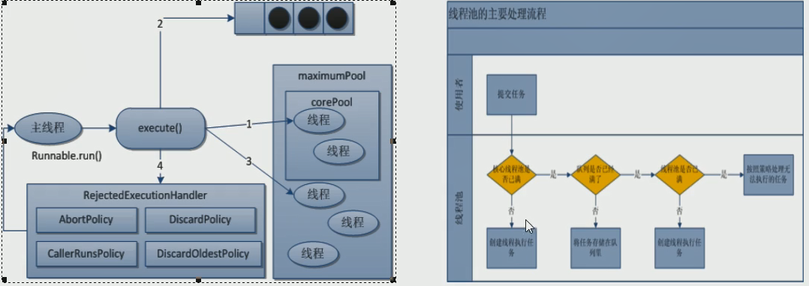
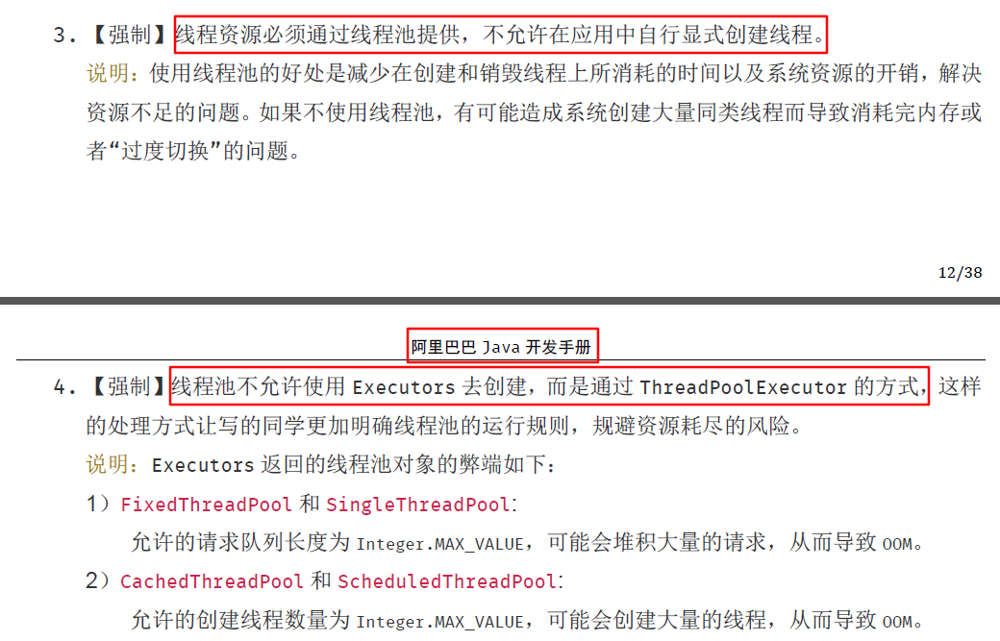

# 线程池底层工作原理

线程池做的工作主要是**控制运行的线程的数量**,处理过程中将任务加入队列,然后在线程创建后启动这些任务,如任务超过了最大数量,超出的数量的任务排队等候,等其他线程执行完毕,再从队列中取出任务来执行.

## 线程池优势
主要特点为: 线程复用、控制最大并发数、管理线程.

- 第一: 降低资源消耗. 通过重复利用自己创建的线程降低线程创建和销毁造成的消耗.
- 第二: 提高响应速度. 当任务到达时,任务可以不需要等到线程创建就能立即执行.
- 第三: 提高线程的可管理性.线程是稀缺资源,如果无限的创建,不仅会消耗资源,还会较低系统的稳定性,使用线程池可以进行统一分配,调优和监控.

## 线程池实现
- Executors.newFixedThreadPool(int)

创建一个定长线程池,可控制线程的最大并发数,超出的线程会在队列中等待;
```java
public static ExecutorService newFixedThreadPool(int nThreads) {
    return new ThreadPoolExecutor(nThreads, nThreads,
                                  0L, TimeUnit.MILLISECONDS,
                                  new LinkedBlockingQueue<Runnable>());
}
```

- Executors.newSingleThreadExecutor()

创建一个单线程化的线程池,它只会用唯一的工作线程来执行任务,保证所有任务都按照指定顺序执行;
```java
public static ExecutorService newSingleThreadExecutor() {
    return new FinalizableDelegatedExecutorService
        (new ThreadPoolExecutor(1, 1,
                                0L, TimeUnit.MILLISECONDS,
                                new LinkedBlockingQueue<Runnable>()));
}
```

- Executors.newCachedThreadPool()

创建一个可缓存线程池,如果线程池长度超过处理需要,可灵活回收空闲线程,若无可回收,则创建新线程;

```java
public static ExecutorService newCachedThreadPool() {
    return new ThreadPoolExecutor(0, Integer.MAX_VALUE,
                                  60L, TimeUnit.SECONDS,
                                  new SynchronousQueue<Runnable>());
}
```

## ThreadPoolExecutor 参数介绍

```java
public ThreadPoolExecutor(int corePoolSize,
                          int maximumPoolSize,
                          long keepAliveTime,
                          TimeUnit unit,
                          BlockingQueue<Runnable> workQueue,
                          ThreadFactory threadFactory,
                          RejectedExecutionHandler handler) {
}
```

1. corePoolSize: 线程池中的常驻核心线程数
2. maximumPoolSize: 线程池能够容纳同时执行的最大线程数,此值大于等于1
3. keepAliveTime: 多余的空闲线程存活时间,当空间时间达到keepAliveTime值时,多余的线程会被销毁直到只剩下corePoolSize个线程为止
4. unit: keepAliveTime的单位
5. workQueue: 任务队列,被提交但尚未被执行的任务
6. threadFactory: 表示生成线程池中工作线程的线程工厂,用户创建新线程,一般用默认即可
7. handler: 拒绝策略,表示当线程队列满了并且工作线程大于等于线程池的最大显示 数(maxnumPoolSize)时如何来拒绝.

## 拒绝策略
等待队列也已经满了,再也塞不下新的任务了同时,线程池的max也到达了,无法接续为新任务服务，这时我们需要拒绝策略机制合理的处理这个问题；

JDK内置的拒绝策略：
- AbortPolicy(默认): 直接抛出RejectedException异常阻止系统正常运行；
- CallerRunPolicy: "调用者运行"一种调节机制,该策略既不会抛弃任务,也不会抛出异常,而是让调用者来运行；
- DiscardOldestPolicy: 抛弃队列中等待最久的任务,然后把当前任务加入队列中尝试再次提交；
- DiscardPolicy: 直接丢弃任务,不予任何处理也不抛出异常.如果允许任务丢失,这是最好的拒绝策略；

## 线程池的底层工作原理



1. 在创建了线程池之后，等待提交过来的任务请求。
2. 当调用 `execute()` 方法添加一个请求任务时，线程池会做如下判断：
	2.1 如果正在运行的线程数量小于 `corePoolSize`,那么马上会创建线程运行这个任务；
	2.2 如果正在运行的线程数量大于或等于 `corePoolSize`,那会将这个任务**放入队列中**；
	2.3 如果这时候队列满了且正在运行的线程数量还小于 `maximumPoolSize`,那么还是要创建非核心线程立刻运行这个任务；
	2.4 如果队列满了且正在运行的线程数量大于或等于 `maximumPoolSize`，那么线程池**会启动饱和拒绝策略来执行**；
3. 当一个线程完成任务时，它会从队列中取下一个任务来执行。
4. 当一个线程无事可做超过一定时间（`keepAliveTime`）时，线程池会判断：
	- 如果当前运行的线程数大于 `corePoolSize`, 那么这个线程就被停掉。


## 工作中 单一的/固定数的/可变的 三种创建线程池的方法，都不用，自定义线程池



## 合理配置线程池
- CPU密集型：该任务需要大量的计算，而没有阻塞，CPU一直全速运行。

一般公式： CPU核数+1

- IO密集型：即该任务需要大量的IO，即大量的阻塞。

大部分线程都阻塞，故需要多配置线程数：

1. CPU核数 * 2
2. CPU核数 / （1 - 阻塞系数）	阻塞系数在0.8~0.9之间
如：8核CPU：8 / （1 - 0.9） = 80 个线程数
